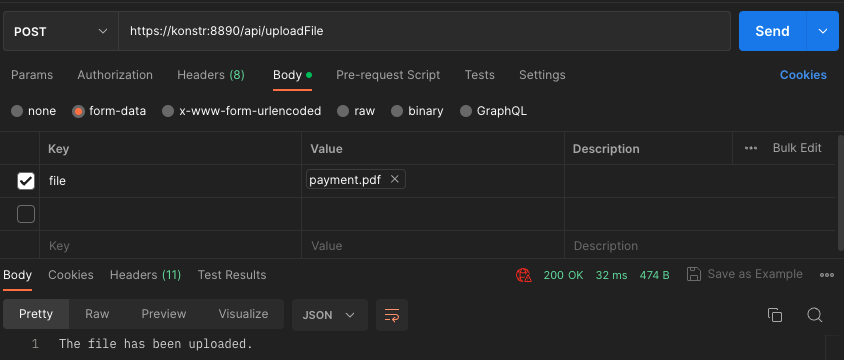

<h1 align="center"># konstructor
<h3 align="center">Репозиторий дипломной работы</h3>
<hr>
В этой ветке я добавил возможность загружать на сервер файлы .plx. Все файлы попадают в папку uploads
<hr>

Пример в POSTMAN



 ## Ссылка для работы
Ссылка uploadFile - позваляет принимать файл на сервер POST запросом "file" "file.plx"
```php
https://konstr:8890/api/uploadFile
```
  
Визуальная работа так же доступна из папки front
